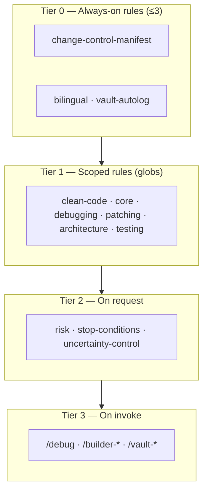
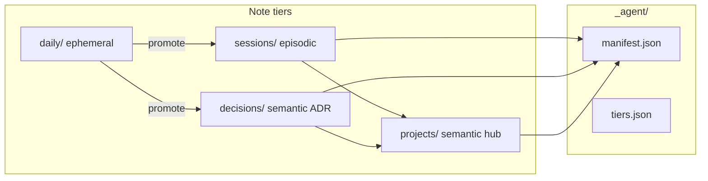

# Architecture — agent-skills pack

Single spine for **where things live** and **how layers connect**. Agent entry: [AGENTS.md](AGENTS.md).

---

## Workspace layout

When the pack sits inside a parent workspace (e.g. `web/`):

```
<workspace>/                    ← Cursor install root
├── .cursor/                    ← runtime junctions ONLY (do not edit)
│   ├── skills → agent-skills/ai-skills/
│   ├── rules  → agent-skills/ai-rules/
│   └── vault  → agent-skills/vault/
├── agent-skills/               ← this git repo (canonical clone name)
└── apps/                       ← application prototypes (not pack meta)
    ├── _shared/                ← design tokens + reset
    ├── go-manga/
    └── arena/
```

**Edit in git:** `agent-skills/ai-skills/`, `agent-skills/ai-rules/` — never commit through `.cursor/` junctions.

---

## 5 pillars

| Pillar | Location | SSoT |
|--------|----------|------|
| **Governance** | `ARCHITECTURE.md`, `change-control-manifest.mdc` | This file + manifest |
| **Rules** | `ai-rules/` | [ai-rules/_index.mdc](ai-rules/_index.mdc) |
| **Skills** | `ai-skills/<name>/` | [ai-skills/_catalog/](ai-skills/_catalog/) |
| **Design** | `apps/_shared/` + per-app `styles.css` | `tokens.css`, `reset.css` |
| **Code** | `apps/<name>/` | App source; rules scoped via globs |

---

## Layer model



Detail: [docs/CHANGE-CONTROL.md](docs/CHANGE-CONTROL.md)

---

## Skill domains

Cursor discovers skills at `.cursor/skills/<name>/SKILL.md` — **flat folders only**. Logical grouping lives in `_catalog/` (not skills).

| Domain | Skills | Flow |
|--------|--------|------|
| Diagnose | debug → scrutinize → fix-record | unknown → review → RCA |
| Build | builder-feature → builder-{ui,api,schema,infra} | plan-only → slice |
| UI pixel | builder-ui-cost · builder-ui | token budget vs full |
| Memory | vault-capture · vault-recall · vault-daily | capture → recall → triage |
| Meta | upgrade-ai · git-push | pack edit → ship |

Catalog files: [ai-skills/_catalog/](ai-skills/_catalog/)

---

## SSoT map

| Question | Read |
|----------|------|
| Agent start | [AGENTS.md](AGENTS.md) |
| Skill list + versions | [docs/th/APPENDIX-TH.md](docs/th/APPENDIX-TH.md) §1 |
| Author new skill | [ai-skills/SKILL-AUTHORING.md](ai-skills/SKILL-AUTHORING.md) |
| Rule activation | [ai-rules/_index.mdc](ai-rules/_index.mdc) |
| Output contract | [templates/template.skill-report.md](templates/template.skill-report.md) |
| Vault layout + tiers | § Vault memory below · [templates/vault/README.md](templates/vault/README.md) |
| Change-control gates | [ai-rules/change-control-manifest.mdc](ai-rules/change-control-manifest.mdc) |
| Thai docs index | [docs/th/README.md](docs/th/README.md) |

**Dedup rule:** README and AGENTS summarize + link here. Version table lives in **APPENDIX-TH only**.

---

## Skill file contract

```
ai-skills/<name>/
├── SKILL.md       ≤ ~180 lines · cheat sheet · REPORT · guardrails one-liner
└── reference.md   phases · close-out gate · depth on demand
```

Pack defaults (Scope Guardrails, token efficiency): [SKILL-AUTHORING.md](ai-skills/SKILL-AUTHORING.md)

Folders starting with `_` (e.g. `_catalog/`) are **indexes**, not skills — excluded from `validate-skills`.

---

## Design tokens (apps)

| File | Role |
|------|------|
| `apps/_shared/reset.css` | Box model reset |
| `apps/_shared/tokens.css` | Shared CSS variables (font, radius, text) |
| `apps/<name>/styles.css` | App-specific tokens + components |
| `apps/<name>/ui-intake.manifest.md` | builder-ui / builder-ui-cost intake |

Each app `index.html` imports shared CSS before local `styles.css`.

---

## Setup

| OS | Command |
|----|---------|
| Windows | `.\scripts\setup-windows.ps1 -InstallRoot <workspace>` |
| macOS / Linux | `./scripts/setup-macos-linux.sh` |

After rename or path change: re-run setup, then Reload Cursor.

Verify: `scripts/validate-skills.ps1` · smoke: [docs/SKILL-SMOKE-CHECKLIST.md](docs/SKILL-SMOKE-CHECKLIST.md)

---

## Vault memory (Obsidian)

Runtime root: `vault/` (gitignored) · Schemas in git: [templates/vault/README.md](templates/vault/README.md)



| Tier | Path | Template | Skill |
|------|------|----------|-------|
| Ephemeral | `daily/YYYY-MM-DD.md` | `template.vault-daily.md` | autolog rule · `/vault-daily` |
| Episodic | `sessions/SLUG.md` | `template.vault-session.md` | `/vault-capture` |
| Semantic ADR | `decisions/SLUG.md` | `template.vault-decision.md` | `/vault-capture` |
| Semantic hub | `projects/SLUG.md` | `template.vault-project.md` | `/vault-capture` |

**Flow:** patch+verify → `append-daily` bullet · งานสำคัญ → `/vault-capture` · สิ้นวัน → `/vault-daily` triage + promote wikilinks

**Retention:** `daily/` excluded from broad recall (`tiers.json` `index_exclude`). After triage, run `scripts/vault/archive-daily.ps1` to move old dailies → `daily/archive/YYYY/`.

**Do not** commit `vault/**` content (except `.gitkeep`) · **Do not** directory-`Grep` gitignored vault — use `grep-vault` or `Read`.
