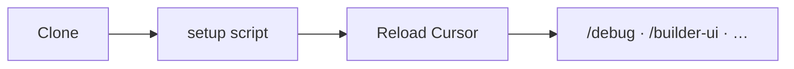
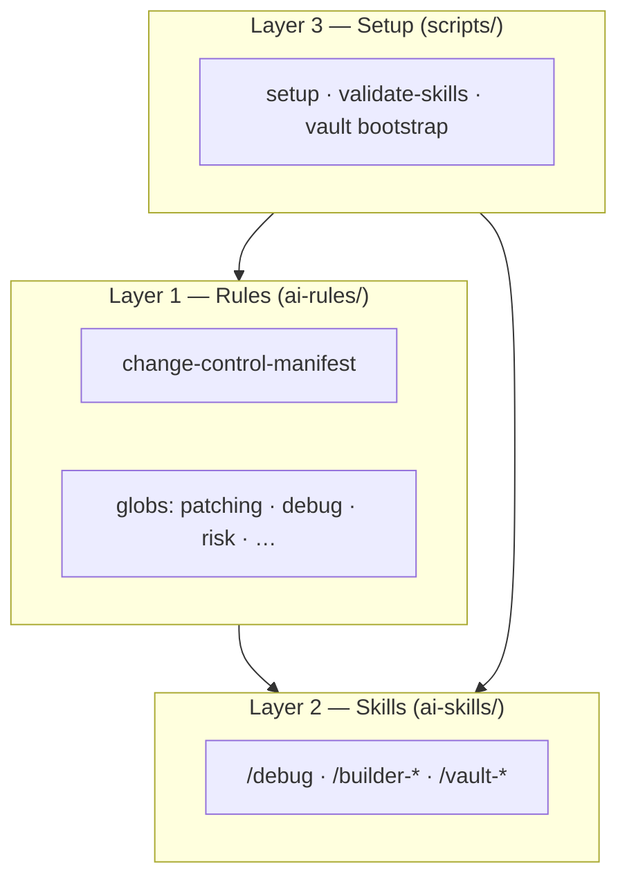

# agent-skills

[](https://github.com/kornthiwars/agent-skills/actions/workflows/validate-skills.yml)

ชุด **Cursor Agent Skills + Rules** สำหรับงาน production — agent ไม่ใช่แค่ “เขียนโค้ดเร็ว” แต่ต้อง **observe → diagnose → patch เล็ก → verify** ก่อนอ้างว่าเสร็จ

รองรับ [Agent Skills open spec](https://agentskills.io/) · ออกแบบให้ invoke ด้วย **`/slash`** · memory ผ่าน **Obsidian vault** บนเครื่อง (gitignore)

**Agent entry:** [AGENTS.md](AGENTS.md) · **คู่มือไทย:** [docs/th/README.md](docs/th/README.md)

---

## สารบัญ

| | Section |
|:--|:--|
| [เกี่ยวกับแพ็ก](#เกี่ยวกับแพ็ก) | ทำอะไร · ใครควรใช้ |
| [ติดตั้ง](#ติดตั้ง) | Clone · setup · reload |
| [โครงสร้าง 3 ชั้น](#โครงสร้าง-3-ชั้น) | Rules · Skills · Scripts |
| [เลือก skill](#เลือก-skill-เมื่อไหร่) | Decision table |
| [Skills ทั้งหมด](#skills-ทั้งหมด) | 13 workflows + version |
| [Rules](#rules) | Always-on + scoped |
| [Vault memory](#vault-memory) | Obsidian · capture · recall |
| [Scripts](#scripts) | setup · validate · vault |
| [เอกสาร](#เอกสาร) | Index ครบ |
| [Contributing](#contributing) | แก้ pack · push |

---

## เกี่ยวกับแพ็ก

**agent-skills** คือ repo หลักของ skill (`ai-skills/`) และ rule (`ai-rules/`) — Cursor โหลดผ่าน **junction** ใต้ `.cursor/` ของ workspace ที่คุณเปิด

| จุดเด่น | รายละเอียด |
|---------|------------|
| **Change-control** | Patch budget (≤5 ไฟล์ / ≤120 บรรทัด), confidence gate, ห้าม fix ก่อน diagnose |
| **SKILL REPORT** | Output รูปแบบเดียวกันทุก skill — สถานะ · หลักฐาน · next action |
| **Slash skills** | `disable-model-invocation: true` — เรียกชัดด้วย `/debug`, `/git-push`, … |
| **Vault** | โน้ต local แบบ Obsidian — session, ADR, project hub, daily triage |
| **Quality** | `validate-skills` + GitHub Actions + [eval prompts](docs/SKILL-EVAL-PROMPTS.md) |

> **Note**  
> แก้ไฟล์ที่ **`ai-skills/`** และ **`ai-rules/`** ใน git เท่านั้น — **อย่า** commit ผ่าน junction `.cursor/skills` โดยตรง

> **Warning**  
> `vault/**` เป็นโน้ตส่วนตัว (gitignore) — อย่า commit เนื้อหา vault ขึ้น GitHub

---

## ติดตั้ง

### สิ่งที่ต้องมี

| รายการ | ใช้ทำอะไร |
|--------|-----------|
| [Git](https://git-scm.com/) | clone / pull |
| [Cursor](https://cursor.com/) | IDE + agent |
| bash (macOS/Linux) หรือ PowerShell 5.1+ (Windows) | รัน setup |

### ขั้นตอน

**1. Clone**

```bash
git clone https://github.com/kornthiwars/agent-skills.git
cd agent-skills
```

**2. Setup** — รันจาก repo หรือชี้ **install root** = โฟลเดอร์ที่เปิดเป็น workspace ใน Cursor

| OS | คำสั่ง |
|----|--------|
| macOS / Linux | `chmod +x scripts/setup-macos-linux.sh && ./scripts/setup-macos-linux.sh` |
| Windows | `.\scripts\setup-windows.ps1 -InstallRoot <workspace>` หรือ `scripts\setup-windows.bat` |

Setup จะสร้าง junction และ bootstrap vault layout — รายละเอียด [scripts/README.md](scripts/README.md)

**3. Reload Cursor** — หลัง pull หรือแก้ skill/rule ต้อง reload

**4. ทดลอง** — ในแชทใหม่พิมพ์ `/debug` หรือ skill อื่น



<details>
<summary><strong>Junction ที่ setup สร้าง</strong> (ใต้ <code>&lt;workspace&gt;/.cursor/</code>)</summary>

| Junction | ชี้ไป | หมายเหตุ |
|----------|-------|----------|
| `skills` | `ai-skills/` | SKILL.md ทุกตัว |
| `rules` | `ai-rules/` | .mdc rules |
| `vault` | `vault/` | โน้ต local · gitignore |

ถ้า workspace เป็นโฟลเดอร์แม่ (เช่น `web/`) ที่มี clone อยู่ข้างใน — รัน setup ให้ install root ชี้ไปโฟลเดอร์ที่เปิดใน Cursor

</details>

---

## โครงสร้าง 3 ชั้น

อธิบายเต็ม → [docs/CHANGE-CONTROL.md](docs/CHANGE-CONTROL.md)



**ลำดับงานที่ agent ควรทำ (สรุป):**

1. Observe → Reproduce → Diagnose  
2. Propose minimal patch (respect budget)  
3. Verify  
4. **Vault autolog** — bullet ลง `vault/daily/<today>.md` หลัง patch+verify  
5. Regression / callee cleanup เมื่อ redirect symbol  

---

## เลือก skill เมื่อไหร่

| สถานการณ์ | Skill |
|-----------|--------|
| Bug · stack trace · ข้อมูลผิด · ยังไม่รู้ root cause | `/debug` |
| Review PR · plan · diff ก่อน merge | `/scrutinize` |
| Feature ข้าม UI+API+schema (ยังไม่ลงมือ patch) | `/builder-feature` (**plan-only**) |
| ทำ UI จาก mock / screenshot | `/builder-ui` |
| ออกแบบ API / contract | `/builder-api` |
| Schema · migration | `/builder-schema` |
| CI/CD · infra · observability | `/builder-infrastructure` |
| RCA หลัง fix ยืนยันแล้ว | `/fix-record` |
| ปรับ skill/rule ใน repo นี้ | `/upgrade-ai` |
| Push ขึ้น GitHub (ต้อง consent) | `/git-push` |
| บันทึก session / ADR ลง vault | `/vault-capture` |
| ค้น memory ใน vault | `/vault-recall` |
| สรุปวัน · triage · promote | `/vault-daily` |

Copy / label ชัด → agent patch ตรงๆ ได้โดยไม่ต้อง `/debug` mantra

---

## Skills ทั้งหมด

ทุก skill มี `SKILL.md` + `reference.md` · bump `metadata.version` เมื่อแก้เนื้อหา

| Skill | Invoke | Ver. | ใช้เมื่อ |
|-------|--------|------|----------|
| debug | `/debug` | 1.3.8 | Four-step diagnosis · mantra · hypothesis ledger |
| scrutinize | `/scrutinize` | 1.2.9 | Outsider review · browser UI · review-only จนกว่า user อนุมัติ |
| builder-feature | `/builder-feature` | 1.8.0 | Plan-only · plan file · design reasoning · slice handoff · **ห้าม** patch app |
| builder-ui | `/builder-ui` | 1.2.10 | UI architecture · a11y · browser verify |
| builder-api | `/builder-api` | 1.2.7 | Contract-first API · auth boundaries |
| builder-schema | `/builder-schema` | 1.2.6 | Schema evolution · migration + rollback plan |
| builder-infrastructure | `/builder-infrastructure` | 1.2.7 | CI/CD · IaC · DR |
| fix-record | `/fix-record` | 1.2.7 | Canonical RCA หลัง validated fix |
| upgrade-ai | `/upgrade-ai` | 1.3.1 | Diagnose skill layer · doc drift · external parity |
| git-push | `/git-push` | 1.2.5 | Inspect · commit เมื่อ user ยืนยัน · push · verify |
| vault-capture | `/vault-capture` | 2.3.7 | Session/ADR · infer project · auto hub |
| vault-recall | `/vault-recall` | 2.4.4 | grep-vault / Read · cite line range |
| vault-daily | `/vault-daily` | 2.2.5 | End-of-day triage · Issues · promote |

Index → [ai-skills/README.md](ai-skills/README.md) · รายละเอียดไทย → [docs/th/SKILLS-TH.md](docs/th/SKILLS-TH.md)

---

## Rules

| Rule / โฟลเดอร์ | บทบาท |
|-----------------|--------|
| [change-control-manifest.mdc](ai-rules/change-control-manifest.mdc) | Always-on — sequence, budget, routing |
| [bilingual-th-en.mdc](ai-rules/bilingual-th-en.mdc) | ตอบไทย ~60% / English ~40% |
| [clean-code.mdc](ai-rules/clean-code.mdc) | มาตรฐานโค้ดที่ agent generate |
| [vault-autolog.mdc](ai-rules/workflow/vault-autolog.mdc) | บังคับ daily bullet หลัง verified patch |
| `core/` · `debugging/` · `patching/` | Gates ตาม glob ของไฟล์ app |
| `architecture/` · `testing/` · `risk/` | API · schema · approval · rollback |

รายละเอียดไทย → [docs/th/RULES-TH.md](docs/th/RULES-TH.md)

---

## Vault memory

Obsidian-native โฟลเดอร์ `vault/` — **ไม่ commit** เนื้อหา (ยกเว้น `.gitkeep`)

| โฟลเดอร์ | Tier | ใช้ทำอะไร |
|----------|------|-----------|
| `daily/` | Ephemeral | สรุปงานวัน · Issues · Promoted links |
| `sessions/` | Episodic | บันทึก session หลังงานสำคัญ |
| `decisions/` | Semantic | ADR |
| `projects/` | Semantic | Project hub / MOC |
| `_agent/manifest.json` | Catalog | Dedupe · recall shortlist |

| Mechanism | บทบาท |
|-----------|--------|
| **bootstrap-vault** | สร้าง layout + Obsidian seed + daily วันนี้ถ้ายังไม่มี |
| **autolog** (rule) | append bullet หลัง patch+verify อัตโนมัติ |
| `/vault-capture` | session/ADR + project hub |
| `/vault-recall` | ค้น + อ้างอิง |
| `/vault-daily` | triage · promote (confirm ก่อน) |

Schemas → [templates/vault/README.md](templates/vault/README.md) · Scripts → [scripts/vault/README.md](scripts/vault/README.md)

---

## Scripts

| Script | คำอธิบาย |
|--------|----------|
| `setup-macos-linux.sh` | Junction skills / rules / vault + bootstrap |
| `setup-windows.ps1` · `.bat` | เหมือนกันบน Windows |
| `validate-skills.sh` · `.ps1` | ตรวจ frontmatter · version · ไม่มี absolute path |
| `scripts/vault/*` | bootstrap · append-daily · grep-vault |

```bash
./scripts/validate-skills.sh          # ก่อน push หลังแก้ skill
./scripts/vault/bootstrap-vault.sh    # หลัง clear vault
```

---

## โครงสร้าง repository

```
agent-skills/
├── ai-skills/           ← SKILL.md + reference.md (แก้ที่นี่)
├── ai-rules/            ← .mdc rules
├── scripts/             ← setup · validate-skills · vault
├── templates/vault/     ← note schemas (git)
├── docs/                ← EN + docs/th/
├── .github/workflows/   ← validate-skills CI
└── vault/               ← โน้ตของคุณ (gitignore)
```

---

## เอกสาร

| เอกสาร | เนื้อหา |
|--------|---------|
| [AGENTS.md](AGENTS.md) | Agent entry · setup · skill index |
| [CHANGE-CONTROL.md](docs/CHANGE-CONTROL.md) | 3 layers · budget · confidence |
| [SKILL-SMOKE-CHECKLIST.md](docs/SKILL-SMOKE-CHECKLIST.md) | Checklist ก่อน ship |
| [DYNAMIC-AGENT-SMOKE.md](docs/DYNAMIC-AGENT-SMOKE.md) | 15 behavioral scenarios |
| [SKILL-EVAL-PROMPTS.md](docs/SKILL-EVAL-PROMPTS.md) | Eval prompt ต่อ skill |
| [EXTERNAL-PARITY.md](docs/EXTERNAL-PARITY.md) | คู่กับ catalog skills ภายนอก |
| [CATALOG-SUBMISSION.md](docs/CATALOG-SUBMISSION.md) | ส่งเข้า awesome-agent-skills |
| [docs/th/README.md](docs/th/README.md) | ดัชนีคู่มือไทย |
| [docs/th/APPENDIX-TH.md](docs/th/APPENDIX-TH.md) | Version table · globs · vault |

---

## Contributing

1. แก้ `ai-skills/` หรือ `ai-rules/` — **bump version** ต่อ skill ที่แตะ ([SKILL-AUTHORING.md](ai-skills/SKILL-AUTHORING.md))  
2. รัน `scripts/validate-skills.ps1` (หรือ `.sh`)  
3. Reload Cursor · รัน smoke ที่เกี่ยวข้อง  
4. Ship ด้วย `/git-push` และคำว่า **`ยืนยัน`** เมื่อพร้อม commit+push  

Pair กับ external skills (Stripe, Playwright, …) ตาม [EXTERNAL-PARITY.md](docs/EXTERNAL-PARITY.md) — **อย่า** bulk-import เข้า `ai-skills/`

---

<div align="center">

**[GitHub](https://github.com/kornthiwars/agent-skills)** · **[Cursor](https://cursor.com/)** · [Report issue](https://github.com/kornthiwars/agent-skills/issues)

</div>
